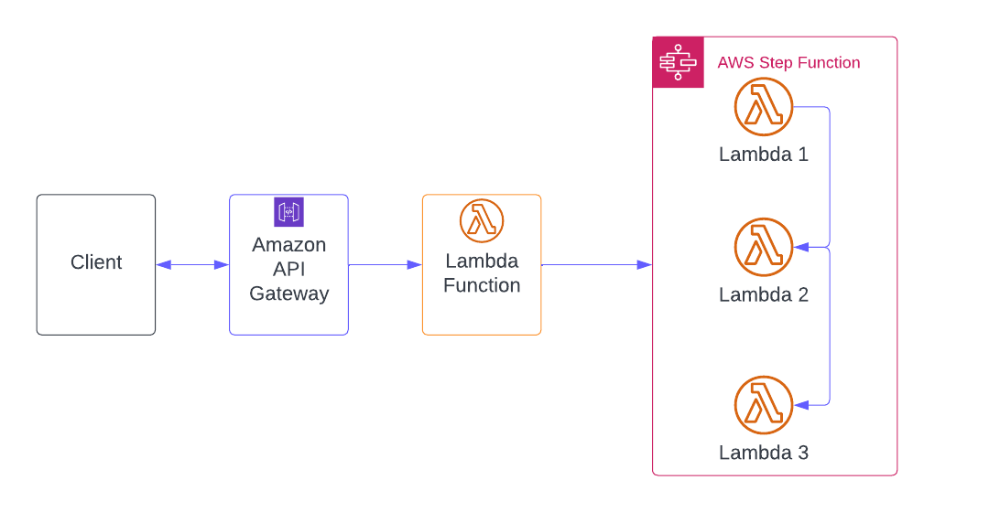

## ARCHITECTURE DESIGN

If we are developing asynchronous services that require multiple microservices to complete a client request, AWS Step Functions are a better alternative to consider. Because of the built-in state management, branching, error handling, and retries that come standard with Step Functions.

In order to design the architecture for the serverless APIs, I will be using the six pillars that are included in the AWS Well-Architected Framework. These pillars are meant to guarantee that individual functions and services are safe, reliable, and highly performant without causing high price.

<https://docs.aws.amazon.com/wellarchitected/latest/framework/the-pillars-of-the-framework.html>

## Security:

### Limit Lambda privileges

- Reduces the risk of over-privileged Lambda functions by following the principle of least privilege, which states that an IAM role should be assigned to a function that only grants access to the services and resources required to complete its task.

### Limit access to application with Virtual Private Clouds

- We can set up virtual firewalls with security groups to control traffic to and from relational databases and EC2 instances, as well as network access control lists (ACLs) to control access to subnets.

### Implement effective policies for managing secrets and credentials

- Consider using a secret management service such as the AWS Secrets Manager. This service enables us to encrypt and manage secrets in order to meet security and compliance standards.

## Reliability:

### Ensure high availability

- Lambda functions, by default, run in Availability Zones (AZs) to achieve high availability. If we deploy Lambda functions on a VPC, we must manually configure that VPC to ensure high availability. To avoid a single point of failure, deploy VPC subnets across multiple AZs.

### Manage failures

- If a function is invoked synchronously, we must manually implement retry logic in the service that invoked it.

- In the event of an error, AWS will automatically initiate retries when functions are invoked asynchronously.

- Another recovery option for Lambda functions that invoke asynchronously is a dead-letter queue. After a few attempts, if an event can't successfully invoke a function, a message specified problem will be sent to the DLQueue. We can also set up procedures that will  handle pending tasks after an issue has been fixed.

## Performance:

### Reduce cold starts

- As Lambda allocates CPU in proportion to memory, giving it extra memory can speed up the initiation and execution of Lambda functions.

- Enabling Provisioned Concurrency that keeps Lambda functions initiated and ready to be executed, further helps to reduce cold starts..

### Implement caching

- We can reduce response times by introducing caching across the entire serverless architecture if the application regularly replies to similar requests.

- If the service has a DynamoDB backend, the cache service DynamoDB Accelerator (DAX) can be used to manage read-intensive workloads and further enhance response times.

### Reduce initialization times

- To increase application performance, we can also optimise the code and dependencies of serverless functions. For instance, initial invocation times for functions written in compiled languages are much slower than those for interpreted languages like Node.js and Python.

- Additionally, it's preferable to minimise the size of the function code package.

## Cost optimization:

### Optimise function memory size

- Provisioned Concurrency minimises cold starts by keeping Lambda functions warm, but it also incurs additional costs.

- To avoid accruing additional costs, we can consider Application Auto Scaling, which enables us to automatically scale Provisioned Concurrency based on usage.

- Scheduling  jobs can also help to keep functions warm

## Operational excellence:

### Monitor key AWS Lambda metrics in context
- such as invocation counts, errors, and duration, from Lambda functions.

### Monitor performance across the stack with distributed tracing

### Standardise serverless logs and centralise them

---
## CI/CD

Any serverless project must have an automated delivery pipeline with a proper set of automated integration tests. To be able to deploy serverless applications multiple times per day and feel secure about it, we must have a reliable automated delivery pipeline to developer account to prod account.

## Use Infrastructure as Code:

- Infrastructure as code entails the management of infrastructure using source code instead of a manual process.

- We can deploy our infrastructure via an automatic delivery pipeline. In this way, those new resources will be deployed to infrastructure automatically.

- This practice is extremely important in modern applications because it lets us treat the infrastructure as code, putting it through the same reviews as  the code, testing applications, and knowing why something in the infrastructure has changed.

- In addition, we can replicate the same infrastructure creating different environments for testing and production, so we can see how the code will run in a production-like environment before it goes to production..

## Have an Automatic Deployment Pipeline:

- Code should always be deployed from a single, centralised location. When the code is complete, the developer should commit it to a shared repository. Following that, an automated deployment pipeline should be initiated. This pipeline can be automated with automatic unit testing and integration tests included.

## Implement Automatic Testing:

- Manual testing of serverless applications can be difficult. The best approach is to write good unit tests first, followed by integration tests. This is how we can ensure that the application works correctly every time it is deployed.

## Independently Deploy Services:

- It is critical to ensure that the internal services can be deployed independently of one another when designing a serverless application.

- It is also critical that these services do not share any private data and that all communication occurs through clearly defined APIs or queues.

## Separate Code from the Configuration:

- Separating the code from the configuration is an important practice for achieving an automated delivery pipeline. Because the infrastructure is also code, we must ensure that both our infrastructure and the code are free of configuration data. If we separate the code and configuration, we can deploy the same code in development, testing, and production environments.